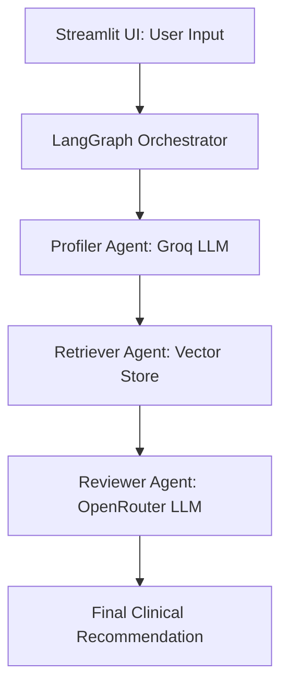
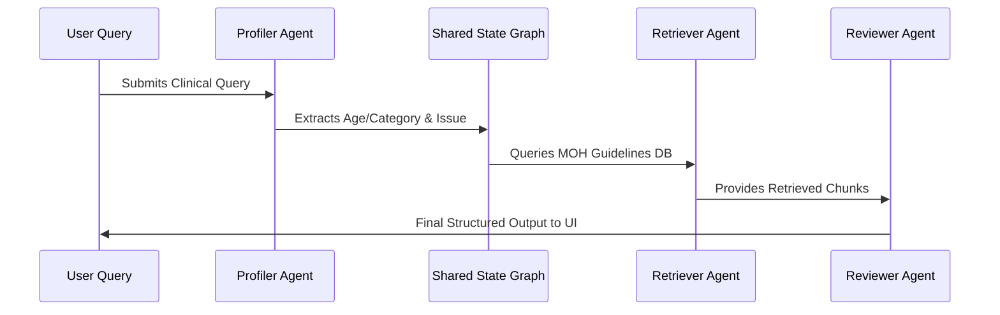

# 👶 Maternal & Child Health Nutrition Advisor

An Agentic AI system designed to assist mothers and health workers with MOH Sri Lanka Infant and Young Child Feeding guidelines, nutritional advice, supplement dosages, and clinical risk evaluation.

---


## Developer Information
* **Developer Name:** H.C Jayangi Wickramarathna
* **Developer Index No:** ITBIN-2313-0125
* **Project:** Sri Lankan Maternal & Child Health Nutrition Multi-Agent System

---

## Project Description
The Maternal & Child Health Nutrition Advisor is an advanced Multi-Agent AI application tailored for the Sri Lankan healthcare context. It automates the retrieval and synthesis of official Ministry of Health (MOH) guidelines regarding infant and young child feeding (IYCF), maternal nutrition, and growth monitoring. By leveraging a collaborative network of specialized AI agents, the system minimizes hallucinations and provides clinical-grade recommendations for healthcare workers and parents.

---

## Live Streamlit Demo Link
* **Live App URL:** Open Streamlit App -->* https://sri-lankan-maternal-child-health-nutrition-akngqnvjzuwvvsqnlbv.streamlit.app/*
---

## Architecture Diagram



---

## Agent-Communication Diagram



---

## Model-Choice Comparison Table

| Agent / Component | Selected Model / Provider | Rationale / Why this Choice? |
| --- | --- | --- |
| **Profiler Agent** | Llama-3-Groq-70b (via Groq) | Extremely fast inference speed and precise structured data extraction for parsing patient details. |
| **Retriever / Utilities** | HuggingFace Embeddings & ChromaDB | High local performance and semantic accuracy for domain-specific local medical documents. |
| **Reviewer Agent** | DeepSeek / Mistral (via OpenRouter) | Superior clinical reasoning, nuance handling, and safe medical synthesis capabilities. |

---

## RAG Pipeline Explanation

The system implements a robust Retrieval-Augmented Generation (RAG) architecture to ensure answers are strictly grounded in local health policies:

1. **Document Ingestion & Chunking:** Official Sri Lankan MOH PDF guidelines are split into manageable semantic chunks.
2. **Embedding Generation:** Text chunks are transformed into vector embeddings using HuggingFace models.
3. **Vector Storage:** Embeddings are indexed in ChromaDB for fast similarity searching.
4. **Context Retrieval:** When a query is entered, the Retriever Agent fetches the top-k most relevant guideline paragraphs.
5. **Grounded Generation:** The Reviewer Agent uses these retrieved excerpts as mandatory context, eliminating generic advice and ensuring 100% adherence to Sri Lankan health standards.

---

## Setup Instructions

1. **Clone the Repository:**
```bash
git clone [https://github.com/Jayangi2001/Sri-Lankan-Maternal-Child-Health-Nutrition.git](https://github.com/Jayangi2001/Sri-Lankan-Maternal-Child-Health-Nutrition.git)
cd Sri-Lankan-Maternal-Child-Health-Nutrition

```


2. **Configure Secrets:**
Set up your API keys securely in your environment or Colab Secrets:
* GROQ_API_KEY
* OPENROUTER_API_KEY


3. **Run the Streamlit App:**
```bash
streamlit run app.py --server.port 8501 --server.address 0.0.0.0

```


---

## Project Features & Pipeline Status

* **Multi-Agent Pipeline:** Active and tested with Sri Lankan MOH guidelines.
* **UI Framework:** Streamlit is fully configured and operational.
* **Tech Stack:** LangGraph, LangChain, Groq, OpenRouter, and HuggingFace.
* **Security:** Secure API key loading implemented via Colab Secrets.
* **Branching & Version Control:** Successfully created and tested feature branches.

---

## Known Limitations

* **Language Support:** Primarily optimized for English queries and clinical terminology matching the English MOH source documents.
* **External Connectivity:** Requires active API keys (Groq and OpenRouter) and internet access to function smoothly.
* **Clinical Disclaimer:** This tool serves as a decision-support aid for educational and workflow assistance and does not replace professional medical diagnosis.

---
